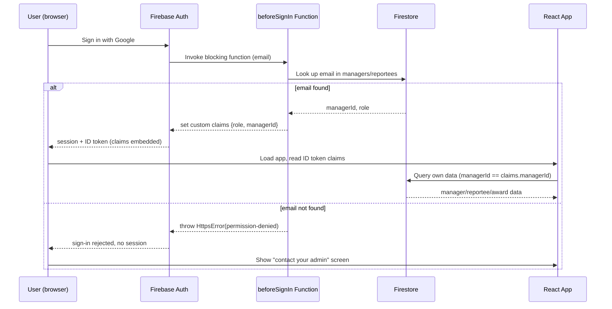

# Firebase Foundation for Rewards & Recognition Tracker - Plan

## Goal Capsule

- **Objective:** A manager can sign in with their own identity and see exactly their own credit balance and award history; an admin can sign in and see the whole org's credit allocation and award activity — both backed by real, persistent, per-user data instead of a role dropdown and in-memory state.
- **Means:** Firebase Auth (Google Sign-In) with a blocking Cloud Function resolving role via custom claims, Firestore as the data store, and a callable Cloud Function for CSV roster import and cycle management (KTD1–KTD4).
- **Product authority:** `docs/ideation/2026-09-21-rewards-tracker-ideation.md` names this as the "foundation bundle" survivor set. This plan owns that bundle only — analytics, notifications, delegate approvers, and other ideation rejects are not in scope.
- **Open blockers:** none.
- **Stop conditions:** if Firestore security rules cannot fully enforce R10 (per-manager data isolation) without also relying on client-side filtering as the sole guard, stop and flag before writing rules that only look correct.

Product Contract preservation: unchanged. All R1–R10 and their Key Decisions from `docs/plans/2026-09-21-1229-feat-firebase-foundation-plan.md`'s prior requirements-only version are carried forward verbatim; no scope change.

---

## Product Contract

### Summary

Replace the fake "viewing as" dropdown in the existing prototype (`extracted/src/App.tsx`) with real Google sign-in restricted to people the admin has already put on the roster, persist managers/reportees/credits/awards/cycles in Firestore instead of React state, and give the admin a one-time bulk-import path to seed the org tree.

### Key Decisions

- **Google Sign-In only, no passwords.** *(session-settled: user-directed — chosen over email/password or magic-link: the org standardizes on Google accounts, and collating Google email to employee name is already the admin's natural one-time setup step)* Governs R1, R2.
- **Unmapped sign-in is blocked, not queued.** *(session-settled: user-directed — chosen over a pending-access admin queue: keeps the one-time setup job a single import step, with no follow-up admin workflow)* Governs R2, R3.
- **Cycles open manually, credits expire (no rollover).** *(session-settled: user-directed — chosen over automatic monthly cycles and credit rollover: matches how the org's real reward-credit system already works, and manual open keeps timing under the admin's control)* Governs R6, R7, R8.
- **Roster import is one CSV covering the whole tree.** *(session-settled: user-directed — chosen over a two-step import: the admin's one-time org-setup job is one file, one pass)* Governs R4.
- **New Firebase project, built from scratch.** *(session-settled: user-directed)* Governs R1, R9.

### Requirements

**Identity & access**

- R1. Managers and admins sign in with Google Sign-In (Firebase Auth); there is no password-based or email-link sign-in path.
- R2. A signed-in Google account only gains access if its email matches a manager or reportee-turned-manager email the admin has placed on the roster; an unmatched email sees a blocked-access message naming that they should contact their admin, with no data exposed.
- R3. Role (`admin` or `manager`) is resolved from a source the signed-in user cannot edit themselves (not a plain Firestore field the client can write) — the role a manager sees is exactly the role the admin assigned them on the roster.

**Roster setup**

- R4. The admin can upload a single CSV that creates the full manager/reportee tree in one pass: each row identifies a manager (name, Google email) and a reportee under them (name, designation).
- R5. After import, the admin can still add, edit, or remove individual managers and reportees one at a time (the prototype's existing manual add/remove flows continue to work alongside bulk import, not instead of it).

**Cycles & credits**

- R6. The admin opens a new award cycle as an explicit action; nothing opens automatically on a schedule.
- R7. Opening a new cycle snapshots each manager's credit allocation (auto-calculated at 40% of current headcount, matching the existing formula) as that cycle's fixed total — later headcount changes do not retroactively change a past cycle's reported allocation.
- R8. When a new cycle opens, each manager's credit balance resets to that cycle's fresh allocation; any credits unused in the prior cycle do not carry over.

**Persistence**

- R9. Managers, reportees, credit allocations, cycles, and awards persist in Firestore; refreshing the page or signing in from a different device shows the same state, not a reset in-memory demo.
- R10. A manager only ever reads and writes their own award records and sees only their own credit balance and history; an admin reads org-wide data across all managers. Enforcement lives at the data layer (Firestore security rules keyed to the resolved role and manager identity from R3), not only in the UI.

### Key Flows

- F1. **Manager signs in and gives an award.** Manager opens the app → signs in with Google → app resolves their role/identity → they land on their own portal showing this cycle's remaining credits → they submit an award (recipient, category, reason) → award is persisted and their balance updates. **Covers R1, R3, R9, R10.**
- F2. **Unmapped account is blocked.** Someone signs in with a Google account not on the roster → sign-in itself is refused at the Cloud Function level → app shows a contact-admin message → no manager/admin view is reachable. **Covers R2.**
- F3. **Admin does one-time org setup.** Admin signs in → uploads the manager/reportee CSV → tree is created with auto-calculated credit allocations → admin spot-checks and manually adjusts any manager or reportee as needed. **Covers R3, R4, R5.**
- F4. **Admin opens a new cycle.** Admin, from the dashboard, explicitly starts a new cycle → each manager's allocation is recalculated and snapshotted → every manager's balance resets to that fresh allocation with no carryover from the prior cycle. **Covers R6, R7, R8.**

### Acceptance Examples

- AE1. **CSV import creates the tree.** Given a CSV row `manager_name, manager_email, reportee_name, reportee_designation`, when the admin uploads it, then a manager document is created (or reused if the email already exists) and the reportee is attached under it — repeated rows for the same manager email add more reportees to that same manager rather than duplicating the manager. **Covers R4.**
- AE2. **Blocked sign-in shows no data.** Given a Google account whose email is not on any manager record, when that person signs in, then the sign-in flow itself is refused (no session is ever established) and no Firestore read for managers, reportees, or awards ever executes for them. **Covers R2, R10.**
- AE3. **Cycle close doesn't leak credit.** Given a manager had 4 credits and used 1 in the closed cycle, when the admin opens the next cycle, then that manager's new balance is the fresh auto-calculated allocation (not 3 + new-allocation) and the closed cycle's historical record still shows 4 allocated / 1 used. **Covers R7, R8.**
- AE4. **Role can't be self-escalated.** Given a manager account, when that user attempts to write a Firestore document that would grant themselves admin access or edit another manager's credits, then the write is rejected by security rules regardless of what the client UI sends. **Covers R3, R10.**

### Scope Boundaries

- **Deferred for later:** CSV export of dashboard data, self-serve admin-triggered invite emails, an audit log distinct from the awards collection itself, mobile-responsive layout polish.
- **Outside this plan's identity:** email/password or magic-link sign-in, a pending-access approval queue for unmapped accounts, automatic/scheduled cycle opening, and credit rollover between cycles.
- **Still out of scope per the original ask, unchanged:** the platform never executes an award (no money, no external system call) — it only records that a manager gave one; reportees do not get their own login or view.

### Dependencies / Assumptions

- Assumes a Firebase project can be created for this org; Spark (free) plan covers Auth + Firestore at this org's scale, but **blocking Cloud Functions (`beforeSignIn`) require the Blaze (pay-as-you-go) plan** even at zero real usage — see KTD1 and the Risks section.
- Assumes the admin has or can obtain the list of Google account emails mapped to each manager and reportee before the first CSV import.
- Builds on the existing prototype's data shapes (`Manager`, `Reportee`, `Award` in `extracted/src/App.tsx`) rather than inventing a new domain model; `credits = 40% of headcount` is carried forward unchanged from `calcDefaultCredits`.

### Open Questions

- **Deferred to Planning (resolved below):** exact Firestore collection shape, security rules syntax, CSV malformed-row handling — see Planning Contract.
- **Deferred to Implementation:** whether reportees later promoted to manager need an explicit "convert" action, or are just added fresh as a new manager row in a future CSV import — no current signal this is a near-term need.
- **Deferred to Implementation:** how the very first admin account is seeded (U2 notes a manual, out-of-band step via the Firebase console or a setup script, since CSV import per R4 only creates managers/reportees, not admins) — the mechanism is an implementation-time detail, but at least one admin identity must exist in Firestore before anyone can sign in at all; U2's implementer should resolve this before U3 is testable end-to-end.

---

## Planning Contract

### Key Technical Decisions

- KTD1. **Role resolution via a `beforeSignIn` blocking Cloud Function, not an `onCreate` trigger.** On every Google sign-in, a 2nd-gen Identity Platform blocking function looks up the signed-in email against Firestore `managers`/`reportees`. Found → sets `role` and `managerId` custom claims on the auth token before it is minted. Not found → throws `HttpsError('permission-denied', ...)`, which stops the sign-in outright — the client never receives a session. This satisfies R2 and AE2 (no session ever exists for an unmapped account) more strongly than an `onCreate` trigger plus an app-side check, which would still let an unmapped user obtain a valid Firebase session before being blocked in the UI. **Requires the Blaze plan** (blocking functions are not available on Spark) — flagged in Risks. Governs R1, R2, R3.
- KTD2. **Firestore schema is flat, not nested arrays.** `managers/{managerId}`, `reportees/{reporteeId}` (with a `managerId` field), `cycles/{cycleId}`, `cycles/{cycleId}/allocations/{managerId}` (snapshot subcollection), `awards/{awardId}` (with `cycleId` and `managerId` fields), and a singleton `meta/currentCycle` doc holding the open cycle's ID. Chosen over embedding reportees as an array on the manager doc (the prototype's in-memory shape) because Firestore security rules can filter a query by field (`where managerId == request.auth.token.managerId`) but cannot filter inside an array field per-element — R10's per-manager isolation needs collection-level, not array-level, access control. Governs R9, R10.
- KTD3. **CSV import runs through a callable Cloud Function (`importRoster`), not client-side Firestore writes.** The client parses the CSV into rows and sends them to `importRoster`, which validates each row, resolves manager email to a `managerId` (creating the manager doc if new, reusing it if the email already exists), and writes managers + reportees in a single batched write. Server-side batching avoids partial-import states a client-side loop could leave on a dropped connection, and keeps CSV-shape validation off the client's Firestore security rules (which should not need to parse row-level business logic). Governs R4, AE1.
- KTD4. **Cycle open runs through a callable Cloud Function (`openCycle`), not a client-side batch write.** `openCycle(label)` reads all managers, computes `calcDefaultCredits(reportee count)` per manager, writes a new `cycles/{cycleId}` doc plus one `allocations/{managerId}` doc per manager in a batch, and updates `meta/currentCycle`. Centralizing this in a function (rather than letting the admin client compute and write allocations directly) keeps the allocation formula in one place and matches KTD1/KTD3's pattern of routing privileged multi-document writes through server code rather than broad client write rules. Governs R6, R7, R8, AE3.
- KTD5. **Firestore security rules key off `request.auth.token.role` and `request.auth.token.managerId`.** A manager's rule set: read own `managers/{managerId}` doc where `managerId == token.managerId`; read `reportees` where `managerId == token.managerId`; read/create `awards` where `managerId == token.managerId` and `cycleId == currentCycle`; no write access to `managers`, `reportees`, `cycles`, or `allocations` (those go through `importRoster`/`openCycle` using the Admin SDK, which bypasses rules). An admin's rule set (`token.role == 'admin'`): read all of the above; no direct write access either — admin mutations to the roster also go through callable functions so `importRoster`/`openCycle` remain the only write path and rules stay read-mostly. Governs R10, AE2, AE4.

### High-Level Technical Design



```mermaid
erDiagram
    MANAGERS ||--o{ REPORTEES : "managerId"
    MANAGERS ||--o{ AWARDS : "managerId"
    CYCLES ||--o{ ALLOCATIONS : "subcollection"
    CYCLES ||--o{ AWARDS : "cycleId"
    MANAGERS ||--o{ ALLOCATIONS : "managerId (doc id)"

    MANAGERS {
        string managerId PK
        string name
        string email
        string designation
    }
    REPORTEES {
        string reporteeId PK
        string managerId FK
        string name
        string designation
    }
    CYCLES {
        string cycleId PK
        string label
        string status
        timestamp openedAt
    }
    ALLOCATIONS {
        string managerId PK_FK
        number allocated
    }
    AWARDS {
        string awardId PK
        string cycleId FK
        string managerId FK
        string recipientId
        string recipientName
        string reason
        string category
        timestamp date
    }
```

### Assumptions

- The admin's Google Workspace/account emails are the same emails collated into the roster during CSV import — no separate identity-mapping step is needed beyond what R4/KTD3 already cover.
- Firebase project region and naming are implementation-time choices with no product impact; deferred to U1.

---

## Implementation Units

### U1. Firebase project + client SDK setup

- **Goal:** Create the Firebase project (Auth with Google provider enabled, Firestore in production mode) and wire the `firebase` client SDK into the Vite app.
- **Requirements:** R1, R9 (Dependencies/Assumptions: Blaze plan required for KTD1).
- **Dependencies:** none.
- **Files:** `extracted/package.json`, `extracted/src/lib/firebase.ts` (new — initializes app, exports `auth`, `db`), `extracted/.env.example` (new — `VITE_FIREBASE_*` keys).
- **Approach:**
  1. Create Firebase project, enable Google Sign-In provider in Auth, create Firestore database.
  2. Upgrade the project to Blaze (required for KTD1's blocking function; still free at this org's volume under the no-cost quota).
  3. Add `firebase` to `extracted/package.json` dependencies.
  4. Add `extracted/src/lib/firebase.ts` initializing the app from `import.meta.env.VITE_FIREBASE_*` and exporting `auth`/`db` singletons.
- **Patterns to follow:** existing Vite env-var convention (`vite.config.ts`'s `@` alias, `AGENTS.md`'s note that styling/config lives in dedicated files, not scattered).
- **Test scenarios:** `Test expectation: none -- pure config/scaffolding, no behavior to unit test.`
- **Verification:** `npm run dev` starts without Firebase init errors; `auth`/`db` are importable from `src/lib/firebase.ts`.

### U2. Cloud Functions project scaffold + roster lookup helper

- **Goal:** Stand up the `functions/` project (2nd-gen, TypeScript, `firebase-admin` + `firebase-functions`) with a shared helper that resolves an email to `{ role, managerId }` from Firestore.
- **Requirements:** R2, R3 (KTD1, KTD2).
- **Dependencies:** U1 (Firestore schema target).
- **Files:** `functions/package.json` (new), `functions/src/index.ts` (new), `functions/src/lib/rosterLookup.ts` (new), `functions/src/lib/rosterLookup.test.ts` (new).
- **Approach:**
  1. Scaffold `functions/` with `firebase-admin`, `firebase-functions` v2.
  2. `rosterLookup(email)`: query `managers` where `email == email` → `{ role: 'admin' or 'manager', managerId }`; else query `reportees` — reportees are not sign-in identities in this plan (R2 covers managers and admins only, not reportees per Scope Boundaries), so a reportee-only email returns not-found.
  3. Admin identity: a small `admins` collection (or a `role: 'admin'` field on a dedicated admin doc set during initial project setup, outside CSV import) — record this as an implementation-time detail; CSV import (U7) only creates managers/reportees, so admin accounts are seeded once, manually, via the Firebase console or an admin-only setup script.
- **Patterns to follow:** none locally (greenfield); mirror Firebase's documented Cloud Functions v2 project structure.
- **Test scenarios:**
  - Given an email matching a `managers` doc, `rosterLookup` returns `{ role: 'manager', managerId }`.
  - Given an email matching a seeded admin identity, `rosterLookup` returns `{ role: 'admin' }`.
  - Given an email matching neither, `rosterLookup` returns `null`.
  - Given an email matching a `reportees` doc only (not also a manager), `rosterLookup` returns `null` — reportees do not get sign-in access (Covers R2, Scope Boundaries).
- **Verification:** unit tests pass against the Firestore emulator.

### U3. `beforeSignIn` blocking function

- **Goal:** Enforce R2/R3 at the auth layer per KTD1 — set custom claims on match, refuse sign-in on no match.
- **Requirements:** R1, R2, R3.
- **Dependencies:** U2.
- **Files:** `functions/src/auth/beforeSignIn.ts` (new), `functions/src/auth/beforeSignIn.test.ts` (new), `functions/src/index.ts` (export the function).
- **Approach:**
  1. Register a `beforeUserSignedIn` (2nd-gen `identity.beforeUserSignedIn`) handler.
  2. Call `rosterLookup(event.data.email)`.
  3. Found → return `{ customClaims: { role, managerId } }`.
  4. Not found → throw `HttpsError('permission-denied', 'Your account is not set up yet. Contact your admin.')`.
- **Execution note:** Security-critical path — write a failing integration test against the emulator for the "not found" rejection case before implementing the happy path.
- **Test scenarios:**
  - Given a mapped manager email, sign-in succeeds and the resulting token carries `role: 'manager'` and the correct `managerId`. Covers F1.
  - Given a mapped admin email, sign-in succeeds and the token carries `role: 'admin'` with no `managerId`.
  - Given an unmapped email, sign-in is rejected with `permission-denied` and no Firebase session is created. Covers F2, AE2.
  - Given a roster lookup that throws (Firestore unavailable), the function fails closed (rejects sign-in) rather than open.
- **Verification:** emulator-based integration test suite covers all four scenarios; manual sign-in with a mapped and an unmapped test Google account confirms the same behavior end-to-end.

### U4. Firestore security rules

- **Goal:** Enforce R10/AE4 at the data layer per KTD5.
- **Requirements:** R10.
- **Dependencies:** U2 (schema), U3 (claims shape).
- **Files:** `firestore.rules` (new), `firestore.rules.test.ts` or equivalent emulator rules test (new, under `functions/` or a dedicated `rules-tests/` dir per Firebase emulator test conventions).
- **Approach:**
  1. Deny-by-default base rule.
  2. `managers/{id}`: read if `token.role == 'admin'` or (`token.role == 'manager'` and `id == token.managerId`); no client writes.
  3. `reportees/{id}`: read if `token.role == 'admin'` or (`token.role == 'manager'` and `resource.data.managerId == token.managerId`); no client writes.
  4. `awards/{id}`: read if `token.role == 'admin'` or (`resource.data.managerId == token.managerId`); create if `token.role == 'manager'` and `request.resource.data.managerId == token.managerId` and `request.resource.data.cycleId == currentCycle` (read from `meta/currentCycle`); no update/delete.
  5. `cycles/**`, `meta/currentCycle`: read for any authenticated user with a resolved role; no client writes.
- **Test scenarios:**
  - Manager A can read their own `managers` doc; cannot read manager B's doc. Covers R10.
  - Manager A can create an award with their own `managerId`; a create with a different `managerId` is rejected. Covers AE4.
  - Manager A cannot write to `managers`, `reportees`, `cycles`, or `allocations` under any payload. Covers AE4.
  - Admin can read across all managers, reportees, and awards.
  - An authenticated user with no custom claims (edge case: claims not yet propagated) is denied all reads until claims refresh.
- **Verification:** `firebase emulators:exec` running the rules test suite; all scenarios pass.

### U5. Replace fake login with real Firebase Auth

- **Goal:** Swap the `ALL_USERS` dropdown in `extracted/src/App.tsx` for real Google sign-in, resolving role/identity from the ID token.
- **Requirements:** R1, R2, R3.
- **Dependencies:** U1, U3.
- **Files:** `extracted/src/App.tsx` (remove `ADMIN_USERS`/`MANAGER_USERS`/`ALL_USERS` and the "Viewing as" `<select>`; add sign-in state), `extracted/src/hooks/useAuth.ts` (new — wraps `onAuthStateChanged`, exposes `{ user, role, managerId, loading }`), `extracted/src/components/SignInScreen.tsx` (new), `extracted/src/components/BlockedScreen.tsx` (new).
- **Approach:**
  1. `useAuth` subscribes to `onAuthStateChanged`, and on a signed-in user, force-refreshes the ID token (`getIdTokenResult(true)`) to read `role`/`managerId` claims.
  2. `App` renders `SignInScreen` when signed out, `BlockedScreen` when signed in but a Google popup/redirect sign-in attempt was rejected by U3 (surfacing the `permission-denied` error message), or the existing admin/manager views once role resolves.
  3. Remove the header's "Viewing as" selector entirely; replace with the signed-in user's real name/photo from the Google profile and a sign-out control.
- **Patterns to follow:** existing `App.tsx` component structure (`AdminDashboard`, `AdminPeopleView`, `ManagerView` stay as-is structurally; only their data source changes in U6).
- **Test scenarios:**
  - Signed-out user sees `SignInScreen` and no app data. Covers F1 (entry).
  - Google sign-in rejected by U3 (unmapped account) surfaces `BlockedScreen` with the contact-admin message, not a generic error or blank screen. Covers F2, AE2.
  - Successful sign-in as a mapped manager renders `ManagerView`; as a mapped admin renders the admin dashboard. Covers F1, F3.
  - Sign-out clears local auth state and returns to `SignInScreen`.
- **Verification:** manual test with a mapped test account and an unmapped test account against the emulator/dev project; both paths behave per the scenarios above.

### U6. Persist managers/reportees/awards through Firestore

- **Goal:** Replace `initialManagers`/`initialAwards`/`useState` mock data in `App.tsx` with live Firestore reads and writes, matching R9/R10's per-role scoping.
- **Requirements:** R5, R9, R10.
- **Dependencies:** U1, U4, U5.
- **Files:** `extracted/src/App.tsx` (remove `initialManagers`, `initialAwards`, and the local `useState`-backed `updateCredits`/`addManager`/`addReportee`/`removeReportee`/`giveAward` functions), `extracted/src/lib/firestore.ts` (new — typed read/write functions: `subscribeManagers`, `subscribeReportees`, `subscribeAwards`, `updateManagerCredits`, `addManager`, `addReportee`, `removeReportee`, `giveAward`).
- **Approach:**
  1. Admin views subscribe to all `managers`/`reportees`/`awards` (rules-permitted for `role == 'admin'`); manager views subscribe filtered to `managerId == token.managerId`.
  2. `giveAward` writes directly to `awards` (client write, rules-checked per U4) rather than going through a callable — this is the one client write path the rules explicitly allow, since it is a single-document create the manager owns.
  3. `updateManagerCredits`/`addManager`/`addReportee`/`removeReportee` (admin's manual one-at-a-time edits, R5) route through a small callable Cloud Function (`adminEditRoster`) rather than direct client writes, consistent with KTD5's read-mostly client rules — record this as a new KTD if it changes rules shape, otherwise treat as an extension of KTD3's pattern.
  4. Preserve `calcDefaultCredits` unchanged; call it from the callable when computing a manual credit reset ("↺ auto" button).
- **Patterns to follow:** existing prototype's `AdminDashboard`/`AdminPeopleView`/`ManagerView` prop shapes — keep their `Manager[]`/`Award[]` prop contracts stable so this unit is a data-source swap, not a component rewrite.
- **Test scenarios:**
  - Manager view shows only that manager's own awards and credit balance, sourced from Firestore, not all managers' data. Covers R10.
  - Admin view shows all managers' credit utilisation and awards, sourced from Firestore. Covers F3.
  - Giving an award writes a new `awards` doc with the correct `managerId`/`cycleId`/`recipientId`, and the manager's displayed remaining balance decrements immediately (via the live subscription). Covers F1.
  - Removing a reportee via the admin UI updates the `reportees` collection and the admin view reflects it without a full page reload.
  - Two browser sessions (one admin, one manager) both see a newly given award appear via live subscription, not just on refresh.
- **Verification:** manual multi-session test against the emulator; award given by a manager account appears in the admin dashboard's "Awards Given" table without a refresh.

### U7. CSV roster bulk-import

- **Goal:** Give the admin a one-time bulk-import path per R4/KTD3/AE1.
- **Requirements:** R4.
- **Dependencies:** U2, U6.
- **Files:** `extracted/src/components/RosterImport.tsx` (new — file picker + preview + submit), `functions/src/roster/importRoster.ts` (new — callable), `functions/src/roster/importRoster.test.ts` (new).
- **Approach:**
  1. Client: parse the CSV into rows (`manager_name, manager_email, reportee_name, reportee_designation`) using a minimal in-browser parser (no new heavy dependency needed for this row shape — a small hand-rolled CSV splitter suffices given the fixed 4-column format; escape-handling for quoted commas is the one edge case worth a shared utility rather than inline string-split).
  2. Client shows a preview table (row count, any parse errors) before submit.
  3. Submit calls `importRoster(rows)` callable; function validates each row (non-empty manager email/name, non-empty reportee name), upserts managers by email, creates reportees, and returns a per-row result (`created` / `skipped: reason`).
  4. Client renders the per-row result so the admin can see what happened.
- **Test scenarios:**
  - Valid CSV with 3 managers × 2 reportees each creates 3 manager docs and 6 reportee docs. Covers AE1.
  - Two rows sharing the same manager email add both reportees under one manager doc, not two. Covers AE1.
  - A row with a blank manager email is skipped and reported back with a reason, not silently dropped or crashing the whole import.
  - Re-uploading the same CSV a second time does not duplicate managers (upsert by email) but does add duplicate reportees unless the reportee's name+managerId pair already exists — decide and document the dedupe key for reportees during implementation (deferred, non-blocking: R4 doesn't specify re-import idempotency for reportees, only for managers).
  - A CSV with a malformed row (wrong column count) is rejected with a row-level error, not an all-or-nothing failure of the whole file.
- **Verification:** emulator-based test of `importRoster` covering all scenarios above; manual test uploading a real sample roster CSV through `RosterImport`.

### U8. Cycle entity + "open new cycle" admin action

- **Goal:** Replace the hardcoded `CURRENT_CYCLE` constant with a real cycle entity per R6/R7/R8/KTD4.
- **Requirements:** R6, R7, R8.
- **Dependencies:** U2, U6.
- **Files:** `extracted/src/App.tsx` (remove `const CURRENT_CYCLE = 'Sep 2026'`; read current cycle from Firestore instead), `extracted/src/components/OpenCycleButton.tsx` (new, admin-only), `functions/src/cycles/openCycle.ts` (new — callable), `functions/src/cycles/openCycle.test.ts` (new).
- **Approach:**
  1. `openCycle(label)`: reads all `managers`, computes `calcDefaultCredits(reportee count)` per manager (reusing the existing formula, ported to `functions/src/lib/`), writes a new `cycles/{cycleId}` doc (`label`, `status: 'open'`, `openedAt`), writes one `allocations/{managerId}` doc per manager under it, marks the previous current cycle `status: 'closed'`, and updates `meta/currentCycle` to the new `cycleId`.
  2. Client reads `meta/currentCycle` to know which cycle is "current" everywhere the prototype currently hardcodes `CURRENT_CYCLE`.
  3. A manager's "remaining" balance is computed client-side as `allocation.allocated - count(awards where managerId == self and cycleId == currentCycle)`, mirroring the prototype's existing `remaining` calculation but against the current cycle's snapshot instead of a mutable `credits` field.
- **Test scenarios:**
  - Opening a cycle with 3 managers (headcounts 10, 8, 5) creates allocations of 4, 3, 2 respectively, matching `calcDefaultCredits`. Covers R7.
  - After opening a new cycle, a manager who had 1 credit used and 3 remaining in the old cycle shows the new cycle's full fresh allocation, not `3 + new_allocation`. Covers R8, AE3.
  - The closed cycle's own allocation and award records are unchanged and still queryable for history (`HistoryTable` equivalent). Covers R7, AE3.
  - Opening a cycle while one is already open closes the old one and only one cycle is ever marked `status: 'open'` at a time.
  - A non-admin calling `openCycle` directly (bypassing the UI) is rejected by the callable's own role check (defense in depth alongside U4's rules, since `cycles`/`allocations` writes only happen via this function).
- **Verification:** emulator-based test of `openCycle` covering all scenarios; manual test opening a second cycle in the dev project and confirming manager balances reset with no carryover.

---

## Verification Contract

- **Emulator suite:** `firebase emulators:exec --only auth,firestore,functions "npm test"` run from `functions/` covers U2–U4, U7, U8's unit/integration tests (Firestore rules tests and Cloud Functions tests both run against the local emulator, not a live project).
- **Client build/typecheck:** `npm run build` (Vite + TypeScript) in `extracted/` must pass with no type errors after U1, U5, U6 land — this is the closest the current toolchain has to a lint gate (no existing test runner is configured in `extracted/package.json`; adding one, e.g. Vitest, is an implementation-time choice, not specified here).
- **Manual end-to-end pass:** with the emulator suite or a real dev Firebase project, walk F1–F4 end-to-end using two test Google accounts (one mapped as manager, one unmapped) before considering the plan done.
- **Rules deploy check:** `firebase deploy --only firestore:rules --project <dev-project>` succeeds and the emulator rules tests (U4) pass before rules are considered complete.

## Definition of Done

- All of R1–R10 are demonstrably true against a running dev Firebase project, not just against the emulator.
- U1–U8 are implemented; every feature-bearing unit's test scenarios pass in the emulator suite.
- The Blaze-plan dependency (KTD1) is confirmed active on the target Firebase project before U3 is considered shippable.
- No leftover in-memory mock data (`initialManagers`, `initialAwards`, `ALL_USERS`) remains in `extracted/src/App.tsx`.
- No dead-end code from abandoned approaches (e.g., an earlier `onCreate`-trigger attempt at role resolution, if tried before settling on KTD1's `beforeSignIn`) remains in the diff.

---

## Risks & Dependencies

- **Blaze plan requirement (KTD1).** Blocking Cloud Functions need the Blaze (pay-as-you-go) plan; Spark cannot host `beforeSignIn`. At this org's scale (a handful of admins, a few dozen managers, low sign-in volume), actual cost should stay at or near $0 under Firebase's free monthly quotas, but this is a real account-level change the admin must approve before U1, not a purely technical detail.
- **Custom claims propagation delay.** A newly granted or changed claim (e.g., admin adds a manager mid-CSV-import) only appears in a client's ID token after that client's next token refresh (up to ~1 hour, or immediately via `getIdTokenResult(true)` after re-sign-in). U5's `useAuth` force-refreshes on sign-in, but a manager added *while already signed in elsewhere* won't see access until they sign out/in or the token naturally refreshes — acceptable for a one-time setup flow, but worth the implementer knowing so it isn't mistaken for a bug.
- **CSV dedupe semantics for reportees (U7)** are left as an implementation-time decision (see U7's test scenarios) since R4 only specifies manager-level idempotency.

---

## Sources / Research

- `extracted/src/App.tsx` — existing prototype: `Manager`/`Reportee`/`Award` types, `calcDefaultCredits`, and the `ADMIN_USERS`/`MANAGER_USERS`/`ALL_USERS` fake-login shell this plan replaces.
- `extracted/AGENTS.md`, `extracted/package.json` — confirms React 19 + Vite 8 + Tailwind v4, no existing test runner, no existing Firebase dependency (greenfield integration).
- `docs/plans/2026-09-21-1229-feat-firebase-foundation-plan.md` (this file's prior requirements-only version) — origin Product Contract, preserved verbatim above.
- Firebase's documented Identity Platform blocking-functions pattern (`beforeSignIn`) and custom-claims-via-Cloud-Function pattern are well-established, stable APIs; this plan applies them directly rather than inventing a custom claims-propagation mechanism. No live external-doc fetch was run for this plan — if Firebase's blocking-functions API shape has changed since this plan's authoring, U3's implementer should verify against current Firebase documentation before coding.
